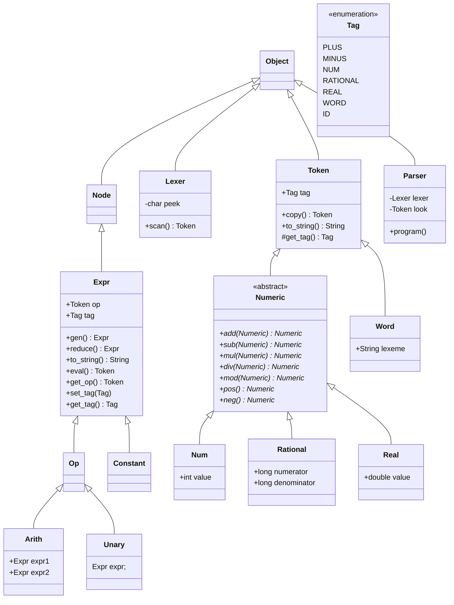

```mermaid
classDiagram
	%% inter

	Op <|-- Arith

	class Arith {
		+Expr expr1
		+Expr expr2
	}

	Expr <|-- Constant
	Node <|-- Expr

	class Expr {
		+Token op
		+Tag tag
		+gen() Expr
		+reduce() Expr
		+to_string() String
		+eval() Token
		+get_op() Token
		+set_tag(Tag)
		+get_tag() Tag
	}

	Object <|-- Node
	Expr <|-- Op
	Op <|-- Unary

	class Unary {
		Expr expr;
	}


	%% lexer

	Object <|-- Lexer

	class Lexer {
		-char peek
		+scan() Token
	}

	Numeric <|-- Num

	class Num {
		+int value
	}

	Token <|-- Numeric

	class Numeric {
		<<abstract>>
		+add(Numeric) Numeric*
		+sub(Numeric) Numeric*
		+mul(Numeric) Numeric*
		+div(Numeric) Numeric*
		+mod(Numeric) Numeric*
		+pos() Numeric*
		+neg() Numeric*
	}

	Numeric <|-- Rational

	class Rational {
		+long numerator
		+long denominator
	}

	Numeric <|-- Real

	class Real {
		+double value
	}

	Object <|-- Token

	class Tag {
		<<enumeration>>
		PLUS
		MINUS
		NUM
		RATIONAL
		REAL
		WORD
		ID
	}

	class Token {
		+Tag tag
		+copy() Token
		+to_string() String
		#get_tag() Tag
	}

	Token <|-- Word

	class Word {
		+String lexeme
	}


	%% parser

	Object <|-- Parser

	class Parser {
		-Lexer lexer
		-Token look
		+program()
	}
```
