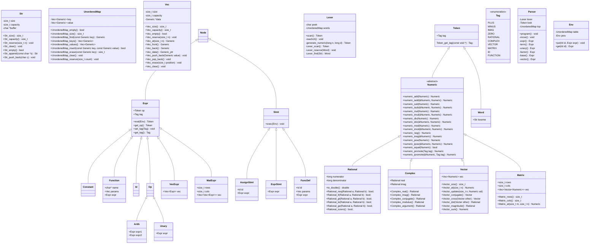

```mermaid
classDiagram
	%% container

	class Str {
		-size_t	size
		-size_t	capacity
		-char	*buffer
		+Str_size() size_t
		+Str_capacity() size_t
		+Str_reserve(size_t n) void
		+Str_clear() void
		+Str_empty() bool
		+Str_append(const char *s) Str
		+Str_push_back(char c) void
	}

	class UnorderedMap {
		-Vec~Generic~ key
		-Vec~Generic~ value
		+UnorderedMap_empty() bool
		+UnorderedMap_size() size_t
		+UnorderedMap_find(const Generic key) Generic
		+UnorderedMap_keys() Vec~Generic~
		+UnorderedMap_values() Vec~Generic~
		+UnorderedMap_insert(const Generic key, const Generic value) bool
		+UnorderedMap_erase(const Generic key) size_t
		+UnorderedMap_clear() void
		+UnorderedMap_reserve(size_t count) void
	}

	class Vec {
		-size_t size
		-size_t capacity
		-Generic *data
		+Vec_size()	size_t
		+Vec_capacity() size_t
		+Vec_empty() bool
		+Vec_reserve(size_t n) void
		+Vec_at(size_t n) Generic
		+Vec_front() Generic
		+Vec_back() Generic
		+Vec_data() Generic_ptr
		+Vec_push_back(Generic value) void
		+Vec_pop_back() void
		+Vec_erase(size_t position) void
		+Vec_clear() void
	}


	%% inter

	Op <|-- Arith

	class Arith {
		+Expr expr1
		+Expr expr2
	}

	Stmt <|-- AssignStmt

	class AssignStmt {
		+Id id
		+Expr expr;
	}

	Expr <|-- Constant
	Node <|-- Expr

	class Expr {
		+Token op
		+Tag tag
		+eval(Env) Token
		+get_op() Token
		+set_tag(Tag) void
		+get_tag() Tag
	}

	Stmt <|-- ExprStmt

	class ExprStmt {
		+Expr expr
	}

	Expr <|-- Function

	class Function {
		+char* name
		+Vec params
		+Expr expr
	}

	Stmt <|-- FuncDef

	class FuncDef {
		+Id	id
		+Vec params
		+Expr expr
	}

	Expr <|-- Id

	Expr <|-- Op

	Node <|-- Stmt

	class Stmt {
		+exec(Env) void
	}

	Op <|-- Unary

	class Unary {
		+Expr expr
	}

	Expr <|-- VecExpr

	class VecExpr {
		+Vec~Expr~ vec
	}

	Expr <|-- MatExpr

	class MatExpr {
		+size_t rows
		+size_t cols
		+Vec~Vec~Expr~~ vec
	}


	%% lexer

	Numeric <|-- Rational

	class Rational {
		+long numerator
		+long denominator
		+to_double() double
		+Rational_neq(Rational a, Rational b) bool;
		+Rational_lt(Rational a, Rational b) bool;
		+Rational_gt(Rational a, Rational b) bool;
		+Rational_le(Rational a, Rational b) bool;
		+Rational_ge(Rational a, Rational b) bool;
		+Rational_iszero() bool;
	}

	Numeric <|-- Complex

	class Complex {
		+Rational real
		+Rational imag
		+Complex_real() Rational
		+Complex_imag() Rational
		+Complex_conjugate() Rational
		+Complex_modulus() Rational
		+Complex_argument() Rational
	}

	class Lexer {
		-char peek
		-UnorderedMap words
		+scan() Token
		-reachch() void
		-generate_numeric(long n, long d) Token
		-Lexer_scan() Token
		-Lexer_reserve(Word) void
		-Lexer_find(Str) Word

	}

	Token <|-- Numeric

	class Numeric {
		<<abstract>>
		+numeric_add(Numeric) Numeric
		+numeric_iadd(&Numeric, Numeric) Numeric
		+numeric_sub(Numeric) Numeric
		+numeric_isub(&Numeric, Numeric) Numeric
		+numeric_mul(Numeric) Numeric
		+numeric_imul(&Numeric, Numeric) Numeric
		+numeric_div(Numeric) Numeric
		+numeric_idiv(&Numeric, Numeric) Numeric
		+numeric_mod(Numeric) Numeric
		+numeric_imod(&Numeric, Numeric) Numeric
		+numeric_neg() Numeric
		+numeric_ineg(&Numeric) Numeric
		+numeric_pow(Numeric) Numeric
		+numeric_ipow(&Numeric, Numeric) Numeric
		+numeric_equal(Numeric) bool
		+numeric_promote(Tag tag) Numeric
		+numeric_ipromote(&Numeric, Tag tag) Numeric
	}

	class Tag {
		<<enumeration>>
		PLUS
		MINUS
		IMAG
		ZERO
		RATIONAL
		COMPLEX
		VECTOR
		MATRIX
		ID
		FUNCTION
	}

	class Token {
		+Tag tag
		Token_get_tag(const void *) Tag;
	}

	Token <|-- Word

	class Word {
		+Str lexeme
	}

	Numeric <|-- Vector

	class Vector {
		+Vec~Numeric~ vec
		+Vector_size() size_t
		+Vector_at(size_t n) Numeric
		+Vector_update(size_t n, Numeric val)
		+Vector_conjugate() Vector
		+Vector_cross(Vector other) Vector
		+Vector_dot(Vocter other) Rational
		+Vector_magnitude() Rational
		+Vector_sum() Numeric
	}

	Numeric <|-- Matrix

	class Matrix {
		+size_t rows
		+size_t cols
		+Vec~Vector~Numeric~~ vec
		+Matrix_rows() size_t
		+Matrix_cols() size_t
		+Matrix_at(size_t m, size_t n) Numeric
	}


	%% parser

	class Parser {
		-Lexer lexer
		-Token look
		-UnorderedMap top
		+program() void
		-move() void
		-expr() Expr
		-term() Expr
		-unary() Expr
		-factor() Expr
		-base() Expr
		-vector() Expr
	}

	%% symbol

	class Env {
		-UnorderedMap table
		-Env prev
		+put(Id id, Expr expr) void
		+get(Id id)	Expr
	}

```
