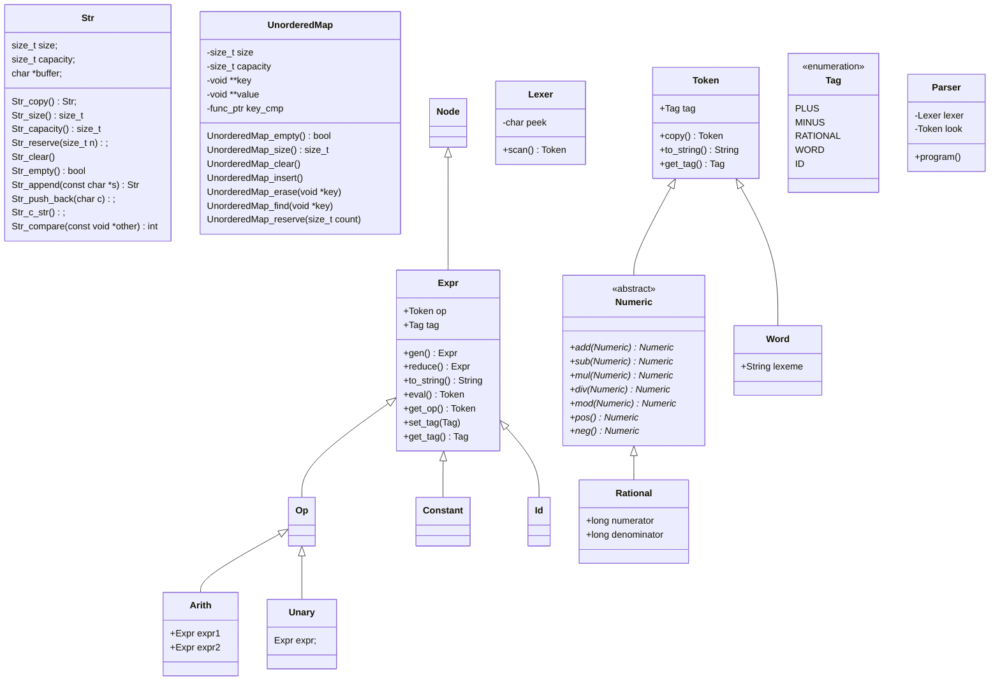

```mermaid
classDiagram
	%% container

	class Str {
		size_t	size;
		size_t	capacity;
		char	*buffer;
		Str_copy() Str;
		Str_size() size_t
		Str_capacity() size_t
		Str_reserve(size_t n);
		Str_clear()
		Str_empty() bool
		Str_append(const char *s) Str
		Str_push_back(char c);
		Str_c_str();
		Str_compare(const void *other) int
	}

	class UnorderedMap {
		-size_t size
		-size_t capacity
		-void **key
		-void **value
		-func_ptr key_cmp
		UnorderedMap_empty() bool
		UnorderedMap_size() size_t
		UnorderedMap_clear()
		UnorderedMap_insert()
		UnorderedMap_erase(void *key)
		UnorderedMap_find(void *key)
		UnorderedMap_reserve(size_t count)
	}


	%% inter

	Op <|-- Arith

	class Arith {
		+Expr expr1
		+Expr expr2
	}

	Expr <|-- Constant
	Node <|-- Expr

	class Expr {
		+Token op
		+Tag tag
		+gen() Expr
		+reduce() Expr
		+to_string() String
		+eval() Token
		+get_op() Token
		+set_tag(Tag)
		+get_tag() Tag
	}

	Expr <|-- Id
	Class Node
	Expr <|-- Op
	Op <|-- Unary

	class Unary {
		Expr expr;
	}


	%% lexer

	class Lexer {
		-char peek
		+scan() Token
	}

	Token <|-- Numeric

	class Numeric {
		<<abstract>>
		+add(Numeric) Numeric*
		+sub(Numeric) Numeric*
		+mul(Numeric) Numeric*
		+div(Numeric) Numeric*
		+mod(Numeric) Numeric*
		+pos() Numeric*
		+neg() Numeric*
	}

	Numeric <|-- Rational

	class Rational {
		+long numerator
		+long denominator
	}

	class Tag {
		<<enumeration>>
		PLUS
		MINUS
		RATIONAL
		WORD
		ID
	}

	class Token {
		+Tag tag
		+copy() Token
		+to_string() String
		+get_tag() Tag
	}

	Token <|-- Word

	class Word {
		+String lexeme
	}


	%% parser

	class Parser {
		-Lexer lexer
		-Token look
		+program()
	}
```
