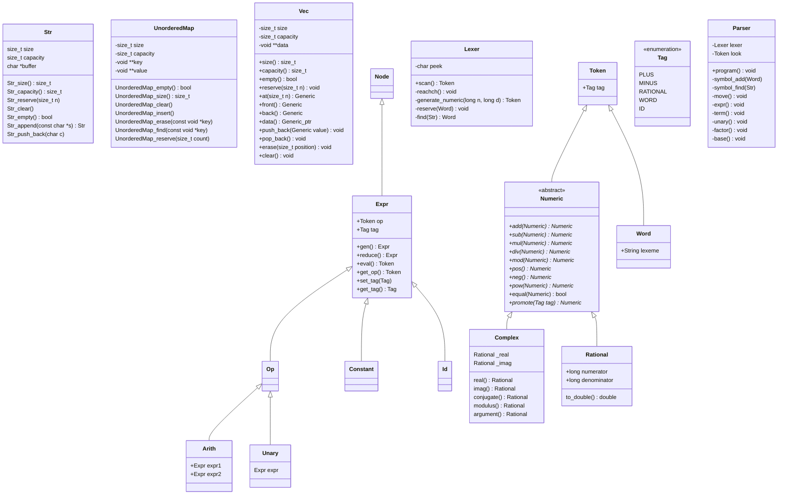

```mermaid
classDiagram
	%% container

	class Str {
		size_t	size
		size_t	capacity
		char	*buffer
		Str_size() size_t
		Str_capacity() size_t
		Str_reserve(size_t n)
		Str_clear()
		Str_empty() bool
		Str_append(const char *s) Str
		Str_push_back(char c)
	}

	class UnorderedMap {
		-size_t size
		-size_t capacity
		-void **key
		-void **value
		UnorderedMap_empty() bool
		UnorderedMap_size() size_t
		UnorderedMap_clear()
		UnorderedMap_insert()
		UnorderedMap_erase(const void *key)
		UnorderedMap_find(const void *key)
		UnorderedMap_reserve(size_t count)
	}

	class Vec {
		-size_t size
		-size_t capacity
		-void	**data
		+size()	size_t
		+capacity() size_t
		+empty() bool
		+reserve(size_t n) void
		+at(size_t n) Generic
		+front() Generic
		+back() Generic
		+data() Generic_ptr
		+push_back(Generic value) void
		+pop_back() void
		+erase(size_t position) void
		+clear() void
	}


	%% inter

	Op <|-- Arith

	class Arith {
		+Expr expr1
		+Expr expr2
	}

	Expr <|-- Constant
	Node <|-- Expr

	class Expr {
		+Token op
		+Tag tag
		+gen() Expr
		+reduce() Expr
		+eval() Token
		+get_op() Token
		+set_tag(Tag)
		+get_tag() Tag
	}

	Expr <|-- Id
	Class Node
	Expr <|-- Op
	Op <|-- Unary

	class Unary {
		Expr expr
	}


	%% lexer

	Numeric <|-- Complex

	class Complex {
		Rational _real
		Rational _imag
		real() Rational
		imag() Rational
		conjugate() Rational
		modulus() Rational
		argument() Rational
	}

	class Lexer {
		-char peek
		+scan() Token
		-reachch() void
		-generate_numeric(long n, long d) Token
		-reserve(Word) void
		-find(Str) Word

	}

	Token <|-- Numeric

	class Numeric {
		<<abstract>>
		+add(Numeric) Numeric*
		+sub(Numeric) Numeric*
		+mul(Numeric) Numeric*
		+div(Numeric) Numeric*
		+mod(Numeric) Numeric*
		+pos() Numeric*
		+neg() Numeric*
		+pow(Numeric) Numeric*
		+equal(Numeric) bool
		+promote(Tag tag) Numeric*
	}

	Numeric <|-- Rational

	class Rational {
		+long numerator
		+long denominator
		to_double() double
	}

	class Tag {
		<<enumeration>>
		PLUS
		MINUS
		RATIONAL
		WORD
		ID
	}

	class Token {
		+Tag tag
	}

	Token <|-- Word

	class Word {
		+String lexeme
	}


	%% parser

	class Parser {
		-Lexer lexer
		-Token look
		+program() void
		-symbol_add(Word)
		-symbol_find(Str)
		-move() void
		-expr() void
		-term() void
		-unary() void
		-factor() void
		-base() void
	}
```
